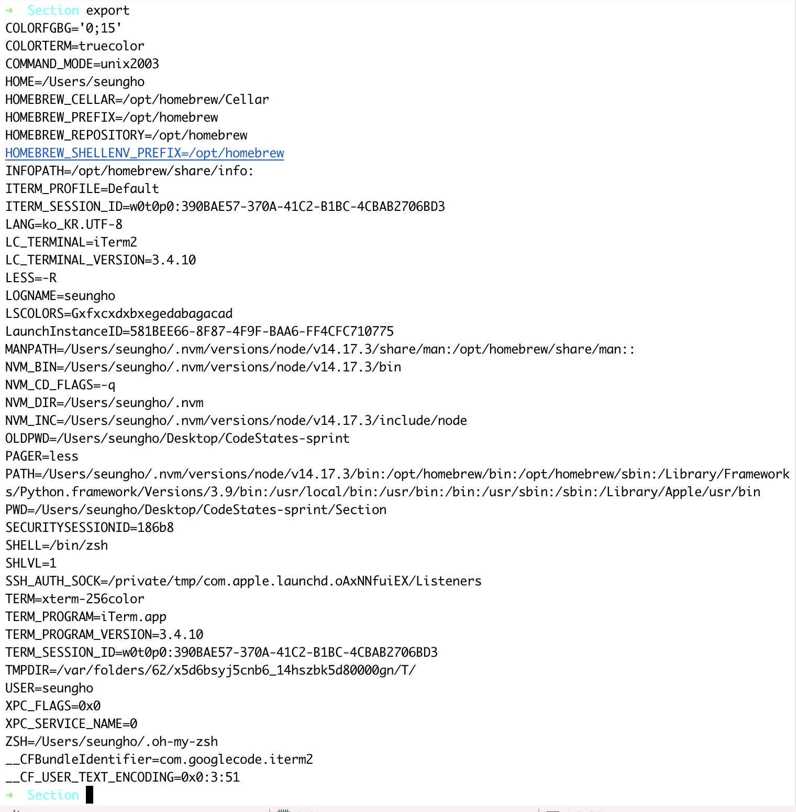

# Linux 심화


### 사용 권한

> ### Achivement Goals
>
> - 사용 권한과 소유자에 대해 이해하고, 사용 권한을 변경할 수 있다.
>   - 파일의 소유자와 파일에 적용된 사용 권한을 확인하고 이해할 수 있다. `ls -l`
>   - 파일에 적용된 사용 권한을 변경할 수 있다. `chmod`


ls -l` 을 입력하면 해당 파일 또는 디렉토리에 적용된 사용 권한을 확인할 수 있다. 


해당 정보는 다음과 같이 해석할 수 있다.


- User : 파일의 소유자. 기본적으로 파일을 생성한 사람이 소유자이다. 
- group : 그룹에는 여러 user가 포함될 수 있다. 그룹에 속한 모든 user는 파일에 대한 동일한 group 액세스 권한을 갖는다.
- Other : 파일에 대한 액세스 권한이 있는 다른 user를 말한다. **파일을 만들지 않은 다른 모든 user를 말한다. **


**chmod** 명령어를 사용하면 권한을 변경할 수 있다.

두 가지 방식이 있는데

- 첫 번째는  더하기(`+`), 빼기(`-`), 할당(`=`)과 액세서 유형을 표기해서 변경하는 Symbolic method
- 두 번째는 rwx를 3 bit로 해석하여, 숫자 3자리로 권한을 표기해서 변경하는 Absolute form

**`sudo`**? 일반 사용자가 root 권한(관리자 권한)을 빌려서 명령어를 실행할 때 활용하는 명령어

**`su`**? 계정 전환 명령어

### Symbolic method

| Access class         | Operator             | Access Type |
| -------------------- | -------------------- | ----------- |
| u (user)             | + (add access)       | r (read)    |
| g (group)            | - (remove access)    | w (write)   |
| o (other)            | = (set exact access) | x (execute) |
| a (all: u, g, and o) |                      |             |

`chmod`명령어 뒤에 변경할 권한을 입력한다. 액세스 클래스의 ugoa를 변경할 조건에 따라 조합해 입력하고, 연산자와 액세스 타입을 순서대로 입력한다.

```
chmod g-r filename # removes read permission from group
chmod g+r filename # adds read permission to group
chmod g-w filename # removes write permission from group
chmod g+w filename # adds write permission to group
chmod g-x filename # removes execute permission from group
chmod g+x filename # adds execute permission to group
chmod o-r filename # removes read permission from other
chmod o+r filename # adds read permission to other
chmod o-w filename # removes write permission from other
chmod o+w filename # adds write permission to other
chmod o-x filename # removes execute permission from other
chmod o+x filename # adds execute permission to other
chmod u+x filename # adds execute permission to user

//
chmod a=rw helloworld.js # -rw-rw-rw-
chmod u= helloworld.js # ----rw-rw-
chmod a+rx helloworld.js # -r-xrwxrwx
chmod go-wx helloworld.js # -r-xr--r--
chmod a= helloworld.js # ----------
chmod u+rwx helloworld.js # -rwx------
```


### Absolute form

Absolute form은 숫자 7까지 나타내는 3 bit의 합으로 표기한다.

| #    | Sum                | rwx  | Permission              |
| ---- | ------------------ | ---- | ----------------------- |
| 7    | 4(r) + 2(w) + 1(x) | rwx  | read, write and execute |
| 6    | 4(r) + 2(w) + 0(-) | rw-  | read and write          |
| 5    | 4(r) + 0(-) + 1(x) | r-x  | read and execute        |
| 4    | 4(r) + 0(-) + 0(-) | r--  | read only               |
| 3    | 0(-) + 2(w) + 1(x) | -wx  | write and execute       |
| 2    | 0(-) + 2(w) + 0(-) | -w-  | write only              |
| 1    | 0(-) + 0(-) + 1(x) | --x  | execute only            |
| 0    | 0(-) + 0(-) + 0(-) | ---  | none                    |

**예시**

```
# u=rwx (4 + 2 + 1 = 7), go=r (4 + 0 + 0 = 4)
chmod 744 helloworld.js # -rwxr--r--
```


**`chmod`** 명령어로 권한 설정을 하는 이유


<br>

### 환경 변수

> ### Achivement Goals
>
> - PC에 저장하는 환경변수가 무엇인지 이해하고, 사용할 수 있다.
>   - PC에 저장된 환경변수를 확인할 수 있다. `export`
>   - PC에 저장된 환경변수를 불러올 수 있다. `dotenv`
>   - Node.js에서 환경변수를 영구적용할 수 있다. `.env`


`export` 명령어를 사용하면 기록된 환경변수를 확인하거나



 새로운 환경 변수를 추가할 수 있다. **이때 등호표시 앞뒤에 공백이 없어야 한다.**


<br>

[npm 모듈 dotenv](https://www.npmjs.com/package/dotenv#Config)를 사용하면, 자바스크립트에서 환경변수를 사용할 수 있다. 	

```
mkdir environment_variable
cd environment_variable
npm init
npm i dotenv # dotenv 모듈을 설치합니다.
```


