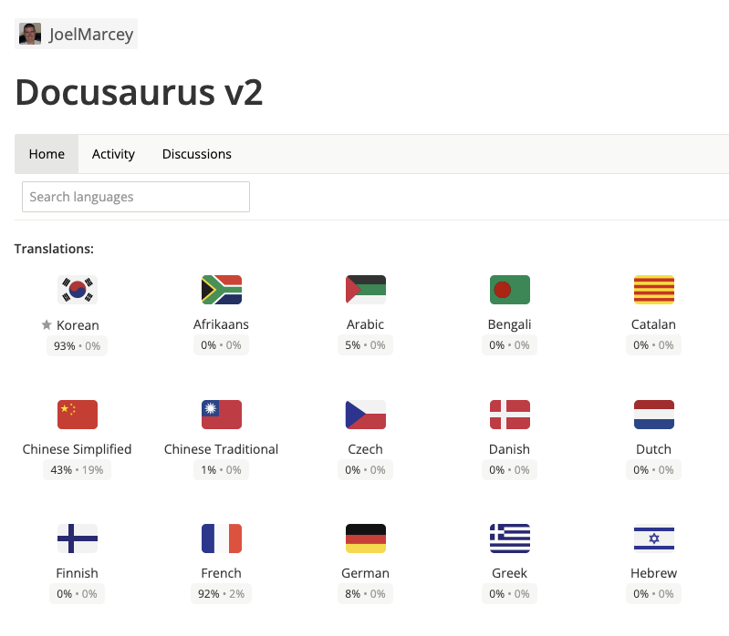

# 블로그 이사 준비 과정

개발공부를 시작하면서 그날그날 배운 내용을 혼자 복습하는 느낌으로 끄적이던게 벌써 포스팅이 100개가 다되어갈 무렵... 심각한 고민거리가 생겼다.

왜 난 Jekyll기반의 블로그를 사용하고 있는가..? 😱

HTML CSS JavaScript와 JavaScript를 기반으로 ReactJS를 공부하고 있는데 뜬금없이 Jekyll이란 녀석을 다루려니까 손쓰기가 어려워 About페이지 하나도 제대로 못만들었는데, 중요한점은 Jekyll은 Ruby언어를 기반으로 만들어진 도구라 이제 막 개발공부를 시작하는 입장에서 한창 공부하고 있는 JavaScript를 제대로 활용할 수가 없었다. 

그래서!

과감하게 지금의 블로그 폐쇄를 결정했고, React를 좀 더 활용해서 숙달할 겸 완전 백지부터 만들기를 시도하기가 수차례...  (결과물은 절대로 공개하지 않을거다)

아직 실력이 모자란 것을 인정하고 또다시 이리저리 템플릿을 뒤적거리다가 **[docusaurus](https://docusaurus.io/ko/)**라는 녀석을 발견했다. 

도큐사우루스는 Jekyll과 마찬가지로 정적 사이트 생성 도구로 리액트를 개발한 페이스북에서 개발했다. 가장 큰 장점으로 React의 기능을 그대로 사용할 수도 있고, 기존에 사용하던 Markdown도 사용 가능하다. 심지어 V2에서  (아직 공부하진 않았지만) 타입스크립트까지 지원한다. 지난 Section2에서 배운 CSS-in-JS도 지원하니 [`styled-components`](https://styled-components.com/docs/advanced#server-side-rendering)도 사용할 수 있다. 

공식문서도 한국어 번역이 거의 다 되어있어 편리하기까지 하다. 

### 📕 계획

일단 업도드 계획중인 OAuth2.0, Token Sprint 리뷰까진 업로드 해서 포스팅 정리해두고, 이전 포스팅 내용은 백업만 해둔 뒤 레포를 비공개로 돌릴 예정.

앞서 작성한 포스팅들은 공부한 내용을 그대로 copy한 내용들이라 앞으로 취업을 위해 내 언어로 설명할 수 있도록 정리하는 포스팅을 할 예정.

