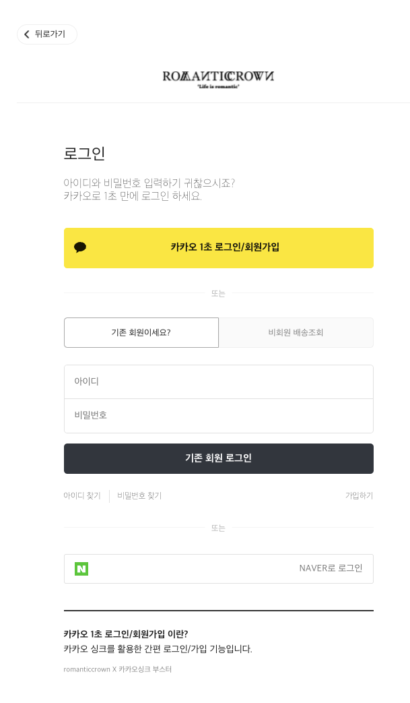

# OAuth

지금도 수많은 웹 사이트의 로그인 창을 보면 별도의 회원가입 없이 로그인 기능을 제공하는 소셜 로그인 기능을 볼 수 있다. 

이렇게 클릭 한 번으로 외부 서비스에서 인증을 하고 그 서비스의 API를 이용하게 하는 프로토콜을 OAuth라고 한다.

 

### OAuth?

OAuth를 좀 더 자세하게 살펴보자.

> *OAuth는 인터넷 사용자들이 비밀번호를 제공하지 않고 다른 웹사이트 상의 자신들의 정보에 대해 웹사이트나 애플리케이션의 접근 권한을 부여할 수 있는 공통적인 수단으로서 사용되는, 접근 위임을 위한 개방형 표준이다. (위키백과)*

 

OAuth가 모든것을 해결해주지는 않는다. 여전히 사용자 정보가 내 서버에 저장되는 것은 변함이 없다. OAuth는 인증(Authentication)dmf 다른 서비스에 맡길 뿐, 접근 권한 관리(Authorization)는 순전히 내 서버의 몫으로 남는다. 다시 말하면, **SNS 로그인 기능을 넣더라도 결국 세션/쿠키 방식이나 토큰을 활용해 인증을 거쳐야 한다.**

 

> 질문: Authentication과 Authorization의 차이가 무엇인가요?
>
> Authentication은 클라이언트가 자신이 장하는 사용자와 같은 사용자인지 확인하는 과정을 말하고, Authorization는 권한부여, 클라이언트가 하고자 하는 작업이 해당 클라이언트에게 허가된 작업인지를 확인하는 과정을 말한다.
>
> [링크](https://baek.dev/post/24/)를 참고하자

 

### OAuth 용어

- Resource Owner : 액세스 중인 리소스의 유저. 김코딩의 구글 계정을 이용하여 App에 로그인할 경우, 이때 Resource owner은 김코딩이다.
- Client : Resource owner를 대신하여 보호된 리소스에 액세스하는 응용프로그램. 클라이언트는 서버, 데스크탑, 모바일 또는 기타 장치에서 호스팅 할 수 있다.
- Resource server : client의 요청을 수락하고 응답할 수 있는 서버.
- Authorization server : Resource server가 액세스 토큰을 발급받는 서버. 클라이언트 및 리소스 소유자를 성공적으로 인증한 후 액세스 토큰을 발급하는 서버를 말한다.
- Authorization grant : 클라이언트가 액세스 토큰을 얻을 때 사용하는 자격 증명의 유형.
- Authorization code : access token을 발급받기 전에 필요한 code. client ID로 이 code를 받아온 후, client secret과 code를 이용해 Access token 을 받아온다.
- Access token : 보호된 리소스에 액세스하는 데 사용되는 credentials. Authorization code와 client secret을 이용해 받아온 이 Access token으로 이제 resource server에 접근을 할 수 있다.
- Scope : scope는 토큰의 권한. 주어진 액세스 토큰을 사용하여 액세스할 수 있는 리소스의 범위를 말한다.

 

### OAuth Flow

 

1. Resource Owner가 Client에게 인증 요청을 한다.
2. Client는 Authorization 요청를 통해 Resource Owner에게 인증할 수단(ex Facebook, google, kakao, naver 등..)을 보낸다.
3. Resource Owner는 해당 요청을 통해 인증을 진행하고 인증을 완료했다는 신호로 Authorization Grant를 url에 실어 Client에게 보낸다.
4. Client는 해당 Authorization Grant를 Authorization Server에 보낸다.
5. **Authorization Server는 Authorization Grant를 확인 후, 유저가 맞으면 Clientdprp Access Token, Refresh Token 그리고 유저의 프로필 정보(id 포함) 등을 발급해준다.**
6. Client는 해당 Access Token을 DB에 저장하거나 Resource Owner에게 넘긴다.
7. Resource Owner(사용자)가 Resource Server에 자원이 필요하면, Client는 Access Token을 담아 Resource Server에 요청한다.
8. Resource Serversms Access Token이 유효한 지 확인 후 Client에게 자원을 보낸다.
9. 만약 Access Token이 만료됐거나 유효하지 않다면, Client는 Authorization Serverdp Refresh Token을 보내 Access Token을 재발급 한다.
10. 그 후 다시 Resource Server에 자원을 요청한다.
11. 만약 Refresh Token도 만료됐으면 Resource Owner는 새로운  Authorization Grant를 Client에게 넘겨야 한다.

 

## 참고 링크

[구글 OAuth 2.0 문서](https://developers.google.com/identity/protocols/oauth2)