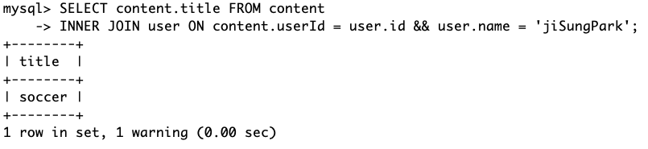
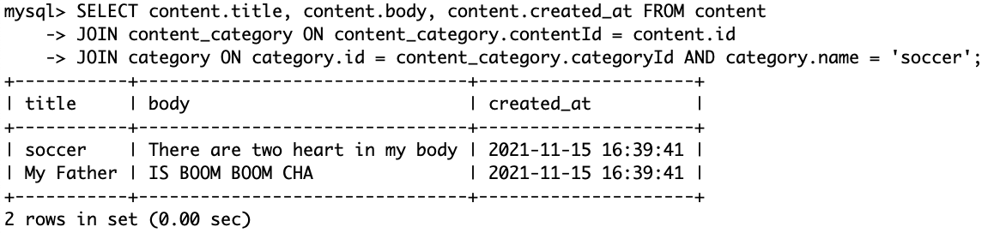
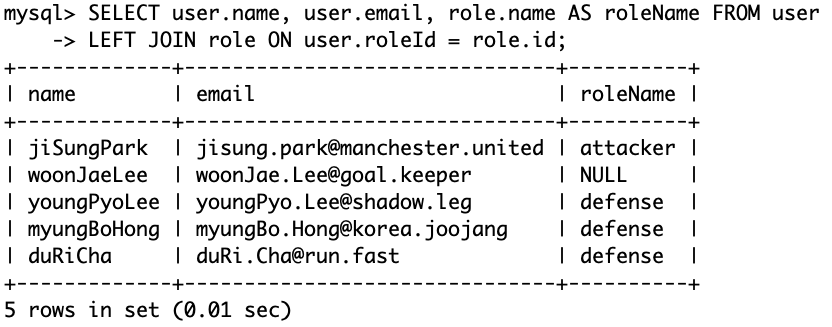
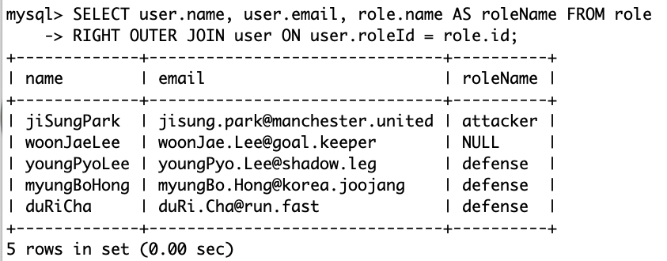
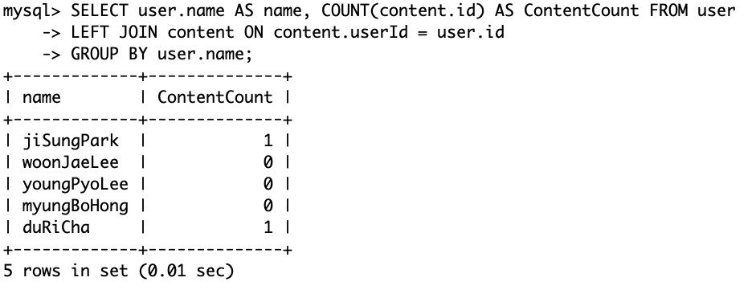

# SQL  JOIN

Join은 관계형 데이터베이스에서 매우 중요한 개념이다. 이를 학습하기 위해 사전준비를 먼저 해보자
<br>

```sql
CREATE TABLE `user` (
  `id` int PRIMARY KEY AUTO_INCREMENT,
  `name` varchar(255) not NULL,
  `email` varchar(255) not NULL
);

CREATE TABLE `content` (
  `id` int PRIMARY KEY AUTO_INCREMENT,
  `title` varchar(255) not NULL,
  `body` varchar(255) not NULL,
  `created_at` timestamp not NULL DEFAULT CURRENT_TIMESTAMP,
  `userId` int,
  FOREIGN KEY (`userId`) REFERENCES `user` (`id`)
);

CREATE TABLE `category` (
  `id` int PRIMARY KEY AUTO_INCREMENT,
  `name` varchar(255) not NULL
);

CREATE TABLE `content_category` (
  `id` int PRIMARY KEY AUTO_INCREMENT,
  `contentId` int NOT NULL,
  `categoryId` int NOT NULL,
  FOREIGN KEY (`contentId`) REFERENCES `content` (`id`),
  FOREIGN KEY (`categoryId`) REFERENCES `category` (`id`)
);

INSERT INTO user (name, email) VALUE ('jiSungPark', 'jisung.park@manchester.united')
INSERT INTO user (name, email) VALUE ('woonJaeLee', 'woonJae.Lee@goal.keeper')
INSERT INTO user (name, email) VALUE ('youngPyoLee', 'youngPyo.Lee@shadow.leg')
INSERT INTO user (name, email) VALUE ('myungBoHong', 'myungBo.Hong@korea.joojang')
INSERT INTO user (name, email) VALUE ('duRiCha', 'duRi.Cha@run.fast')

INSERT INTO content (title, body, user) VALUE ('soccer', 'There are two heart in my body', 'jiSungPark')
INSERT INTO content (title, body, user) VALUE ('My Father', 'IS BOOM BOOM CHA', 'duRiCha')

INSERT INTO categories (name) VALUE ('soccer');
INSERT INTO categories (name) VALUE ('family');
INSERT INTO categories (name) VALUE ('health');

INSERT INTO content_category (category, content) VALUE ('soccer', 'There are two heart in my body');
INSERT INTO content_category (category, content) VALUE ('health', 'There are two heart in my body');
INSERT INTO content_category (category, content) VALUE ('family', 'IS BOOM BOOM CHA');
INSERT INTO content_category (category, content) VALUE ('soccer', 'IS BOOM BOOM CHA');

```


<br>
### INNER JOIN

일반적으로 둘 이상의 테이블에서 서로 특정 조건(ON 뒤에 오는 조건)이 맞는 부분을 찾을 때 사용된다.

```sql
SELECT content.title FROM content
INNER JOIN user ON content.userId = user.id && user.name = 'jiSungPark';
```




JOIN문은 여러번 중첩해서 사용할 수도 있다.

```sql
SELECT content.title, content.body, content.created_at FROM content
JOIN content_category ON content_category.contentId = content.id
JOIN category ON category.id = content_category.categoryId AND category.name = 'soccer';
```




<br>
### OUTER JOIN

특정 값이 없어서 null이라 하더라도 포함시켜 확인할 땐 OUTER JOIN을 사용하면 된다.

```sql
SELECT user.name, user.email, role.name AS roleName FROM user
LEFT OUTER JOIN role ON user.roleId = role.id;
```



위 사진처럼 roleName값이 없는 이운재의 이름과 이메일도 확인할 수 있다.

여기서 사용된 LEFT JOIN은 RIGHT JOIN으로도 대체 가능하다

```sql
SELECT user.name, user.email, role.name AS roleName FROM role
RIGHT OUTER JOIN user ON user.roleId = role.id;
```



<br>

GROUP BY와 함께 쓰면 그룹단위로 확인이 가능하다

```sql
SELECT user.name AS name, COUNT(content.id) AS ContentCount FROM user
LEFT JOIN content ON content.userId = user.id
GROUP BY user.name;
```




[링크](https://sql-joins.leopard.in.ua/)를 통해서 확인 가능하다.