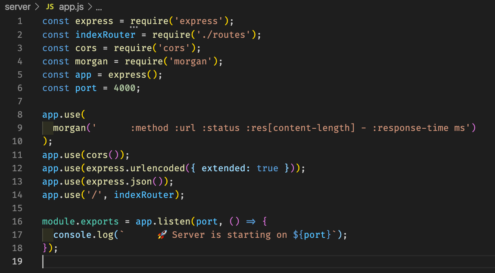
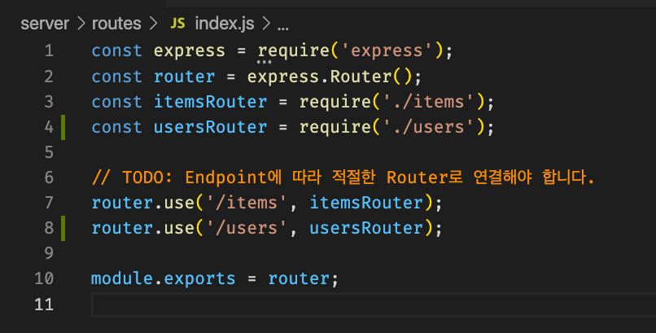
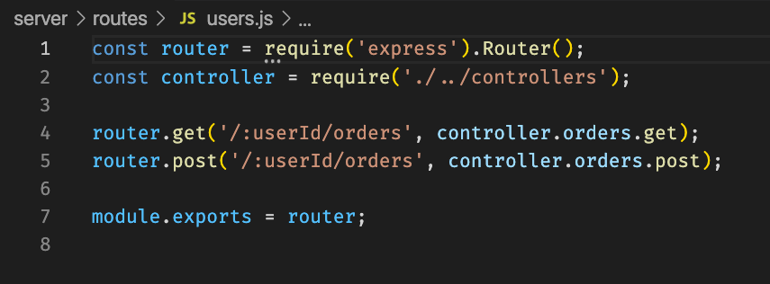

# MVC Sprint review

이전에 포스팅에서 MVC 패턴을 다뤘는데 배운 내용을 바탕으로 하는 스프린트 실습에 대한 리뷰를 가져볼까 한다.


### /Routes

express 미들웨어를 사용해 요청이 들어오면 14번줄의 indexRouter를 참조해 routes 폴더의 index.js로 요청을 전송한다.

이후 들어온 요청의 엔드포인트에 따라 각각 items와 users로 나눠 보낸다.

users 엔드포인트에서 일어난 get와 post요청에 대해 controller에 작성된 req와 res에 대한 처리가 진행된다.
[링크](https://expressjs.com/ko/4x/api.html#router.METHOD)


**한마디로 정의하면 Router는 유저가 보낸 요청에 따라 해당 컨트롤러로 분기시켜주는 역할을 한다.**

### Controllers
```js
  orders: {
    get: (req, res) => {
      const userId = req.params.userId;
      if (!userId) {
        res.status(404).send('Client error')
      } else {
        models.orders.get(userId, (error, result) => {
          if (error) {
            res.status(500).send('Server Error')
          } else {
            res.status(200).json(result);
          }  
        })
      }
    },
    post: (req, res) => {
      const userId = req.params.userId;
      const { orders, totalPrice } = req.body;
      if (!orders) {
        return res.status(400).send('Client error')
      } else {
        models.orders.post(userId, orders, totalPrice, (error, result) => {
          if (error) {
            res.status(500).send('Server Error')
          } else {  
            res.status(201).json(result)
          }
        })
      }
    },
  },
```
요청이 들어오면 각 요청에 대한 응답으로 알맞는 것들을 작성하면 된다. <br>
유저id가 잘못됐거나 잘못된 주문이 작성된 경우 404 에러 상태코드를, 해당 요청은 정상적으로 받았으나 서버에서 에러가 날 경우에는 500 상태코드를, 모든 요청과 응답이 정상적으로 진행된 경우에는 200,201상태코드를 전송하면 된다. (200과 201 상태코드가 의미하는걸 생각해보자.)

### /Models 
```js
  post: (userId, orders, totalPrice, callback) => {
    const queryString = `
    INSERT INTO orders (user_id, total_price) 
    VALUES (${userId}, ${totalPrice})`;
    const queryString2 = `
    INSERT INTO order_items (order_id, item_id, order_quantity)
    VALUES ?`;
    db.query(queryString,  (error, result) => {
      if (error){
        callback(error, null)
      } else {
        const params = orders.map((el) => {
          return [result.insertId, el.itemId, el.quantity];
        })
        db.query(queryString2, [params], (error, result) => {
          if (error) {
            callback(error, null)
          } else {
            callback(null, result);
          }
        })
      }
    })
  }
```
모델에선 해당 요청에 대해 미리 작성된 SQL 쿼리문 양식에 맞춰 정보들을 DB에 보내준다. [Insert Into](https://www.w3schools.com/nodejs/nodejs_mysql_insert.asp)에 기입될 정보들을 확인해서 두 번째 쿼리문에 들어갈 params를 작성하면 된다.<br>
여기서 db.query()의 첫 번째 인자(quertString)는 실행할 쿼리문을, 두 번째 인자([params])는 쿼리문의 VALUES ?에서 작성된 ?에 들어갈 값, 세 번째 callback함수는 실행할 함수를 뜻한다. <br>
[mysql 공식문서](https://www.npmjs.com/package/mysql#establishing-connections)에서 확인하자.
<br>


