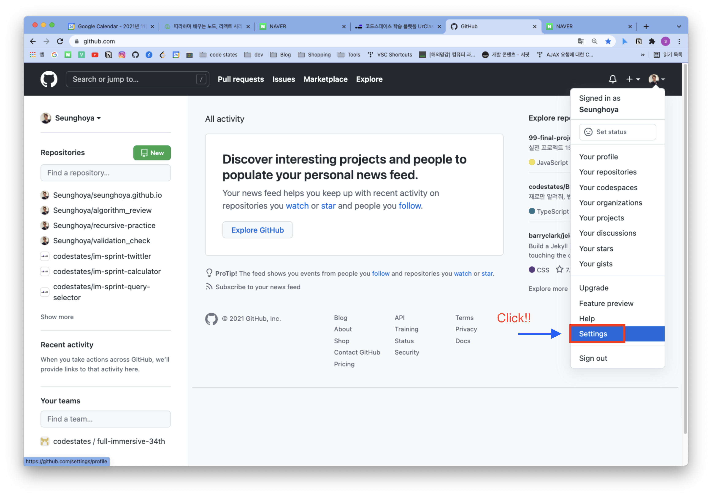
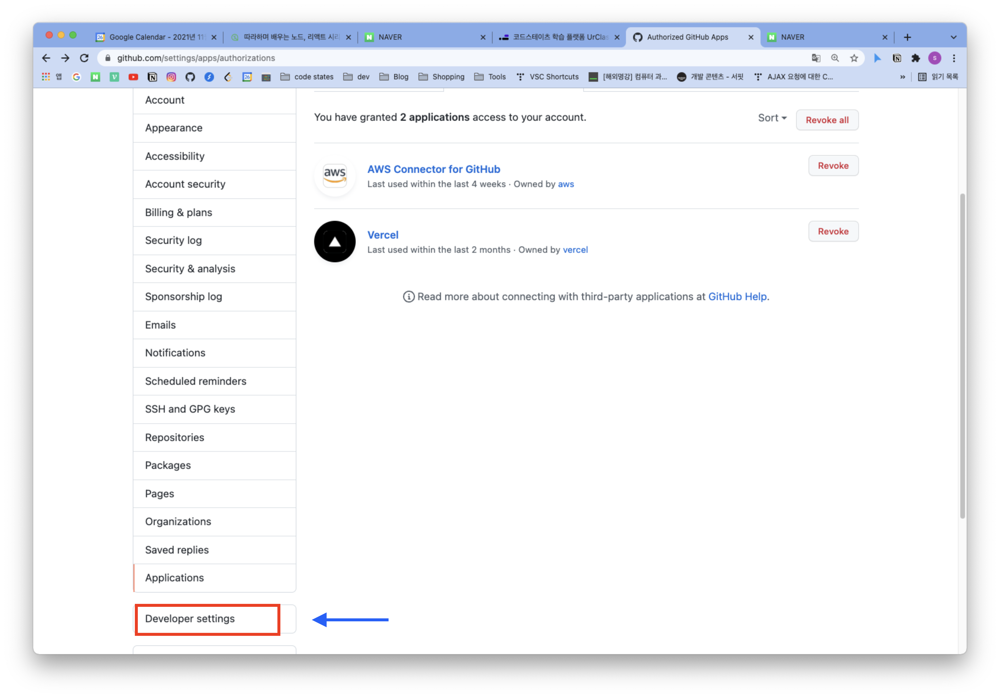
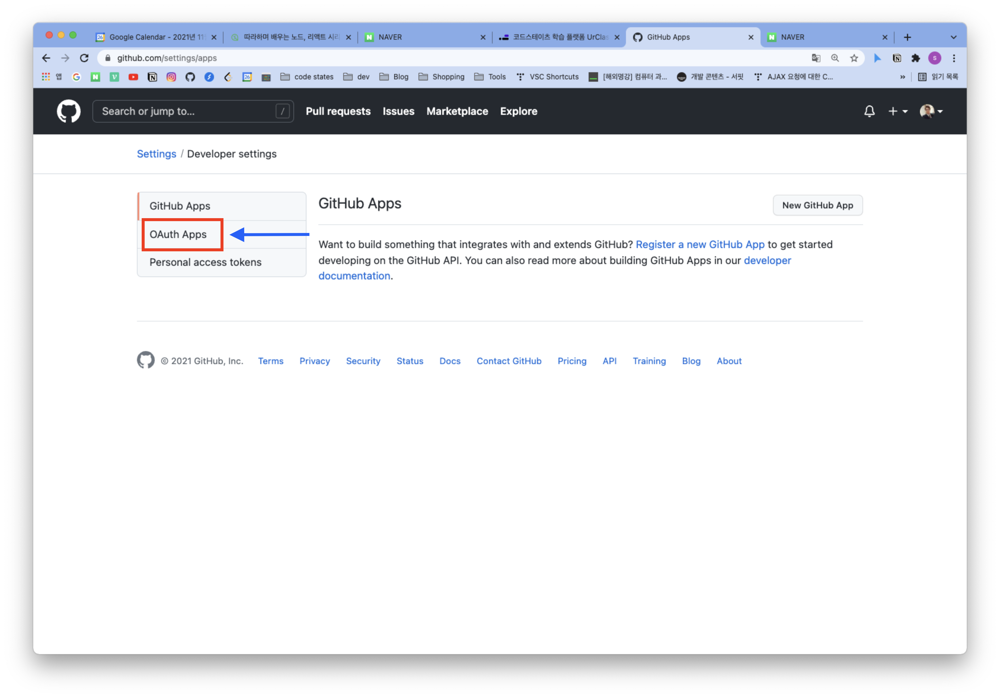
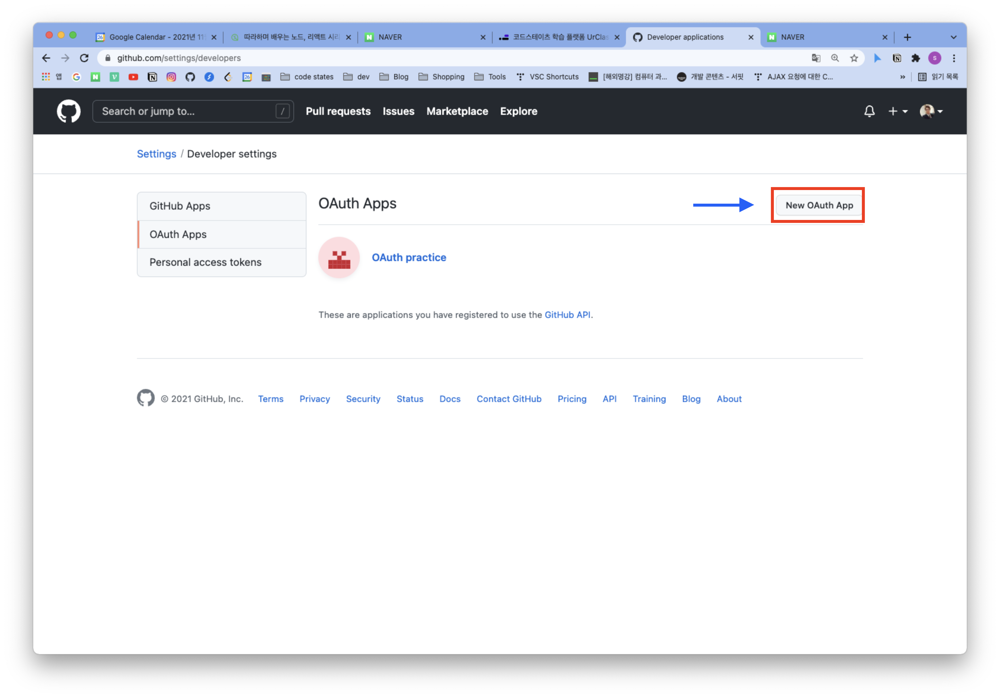
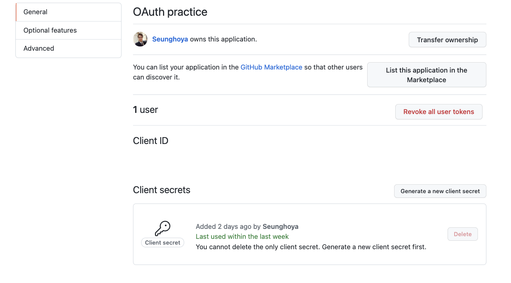

# OAuth Sprint Revew
이번엔 깃허브에서 제공하는 OAuth 인증방식을 이용해 로그인을 구현하는 스프린트를 진행했다. 

## 사전작업
OAuth 인증방식을 이용하기 위해서 첫 번째로 GitHub에 OAuth앱을 등록해야 한다. [링크](https://www.oauth.com/oauth2-servers/accessing-data/create-an-application/)를 참조했다.

> 이미 스프린트를 진행해서 앱이 만들어져있지만 처음 진행할 땐 새로운 앱을 생성하면 된다.  
[링크](https://www.oauth.com/oauth2-servers/accessing-data/create-an-application/)에선 url을 `https://example-app.com`로 등록했지만 로컬 서버에서 진행할거라 `http://localhost:3000`로 리디렉션 한 점이 다르다.

성공적으로 앱을 만들었다면 다음과 같은 화면이 나오게 된다.

## Server

### server/controller/callback.js

클라이언트까지 다 하고나서도 여기서 한참 헤멨는데, post 요청으로 받아오는 데이터가 어떤 형태로 들어오는지 결정하는 것도 매우 중요했다. 21번줄에 헤더 양식을 결정하는 내용을 추가해서 받아와야 원하는 데이터를 json형태로 받아와서 key&value 형태로 받아쓸 수 있었다.

### server/controller/images.js

헤더에 담긴 토큰정보가 제대로 된 것이면 응답에 이미지를 실어서 보내준다. 여기서 이비지는 리소스 폴더에 포함된 이미지 파일들을 말한다.(1번라인 참고)

## Client
### client/src/app.js

먼저 작성한 서버의 callback파일에 요청받는 req로 보내줄 authorizationCode를 생성하고(36번라인 componentDidMount함수), 요청의 응답으로 받는 데이터를 참고해서 상태에 토큰정보를 담아주는 로직을 구현했다.

### client/src/components/Login.js

깃허브 API를 참고해서 url 주소를 작성

### client/src/components/Mypage.js

컴포넌트 상태에 필요한 값들을 입력하고, 헤더에 토큰정보를 담아 깃허브에 요청을 보내면 응답으로 요청에 대한 데이터를 제공받을 수 있다. 이를 상태에 다시 저장하는 로직을 만들고, 서버의 images에도 요청을 보내 이미지 정보를 받아와서(37번 라인) 나열해줬다.(86번라인) 

### 후기
OAuth는 JWT보단 상대적으로 간단했다. 기본적으로 토큰을 생성하고 인증하는 절차를 깃허브를 통해 작업하는 과정만 구현하는 방식이라 서버에도 부담이 적고, 사용자들도 간편하게 이용할 수 있다는 장점이 있는 인증방식이라 더 공부를 해야겠다. 

3일에 걸쳐 쿠키&세션 인증방식, 토큰인증기반, OAuth 인증기반 총 세 가지의 인증과정을 거쳐 로그인을 구현했는데, 확실히 각각의 장단점을 이해하는데 큰 도움이 됐고, 이를 바탕으로 운영하려는 서비스에 어떤 인증방식이 적합한지 판단하는데 큰 도움이 될 수 있을 것 같다. 