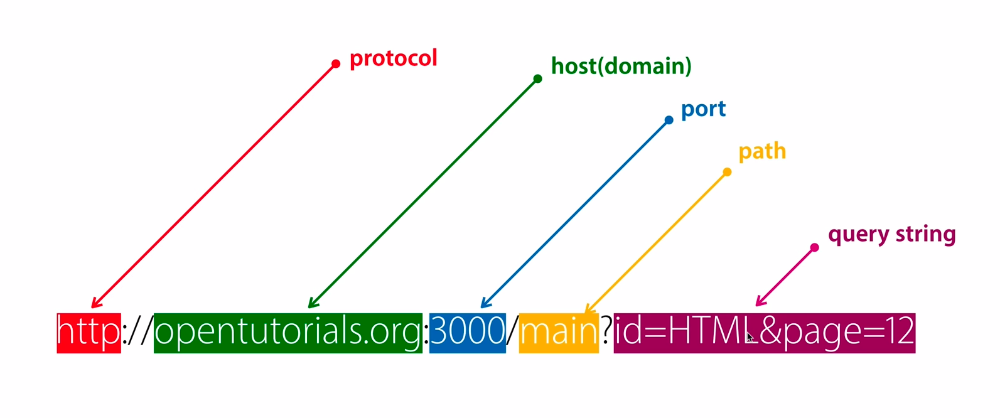

# HTTP 기초

[HTTP](https://developer.mozilla.org/ko/docs/Web/HTTP/Overview)(Hypertext Transfer Protocol)은 HTML 문서와 같은 리소스들을 가져올 수 있도록 해주는 **프로토콜**이다. **프로토콜은 컴퓨터 내부 또는 컴퓨터 사이에서 데이터 교환 방식을 정의하는 규칙체계이다.**

 

웹에서는 클라이언트(브라우저)와 서버 간에 데이터를 주고받기 위한 방식으로 HTTP 프로토콜을 사용하고 있다. 이때 HTTP를 이용해 주고받는 메시지를 **HTTP 메시지**라고 부른다. HTTP 메시지는 **요청(request)**과 **응답(response)**으로 구성되어 있다. 

[mdn 문서](https://developer.mozilla.org/ko/docs/Web/HTTP/Messages)에는 이렇게 작성되어 있다. 자세한 내용은 mdn 문서를 참고해서 공부하자.

> HTTP 요청과 응답의 구조는 서로 닮았으며, 그 구조는 다음과 같습니다.
>
> >1. 시작 줄(start-line)에는 실행되어야 할 요청, 또은 요청 수행에 대한 성공 또는 실패가 기록되어 있습니다. 이 줄은 항상 한 줄로 끝납니다.
> >2. 옵션으로 HTTP 헤더 세트가 들어갑니다. 여기에는 요청에 대한 설명, 혹은 메시지 본문에 대한 설명이 들어갑니다.
> >3. 요청에 대한 모든 메타 정보가 전송되었음을 알리는 빈 줄(blank line)이 삽입됩니다.
> >4. 요청과 관련된 내용(HTML 폼 콘텐츠 등)이 옵션으로 들어가거나, 응답과 관련된 문서(document)가 들어갑니다. 본문의 존재 유무 및 크기는 첫 줄과 HTTP 헤더에 명시됩니다.
>
> HTTP 메시지의 시작 줄과 HTTP 헤더를 묶어서 요청 *헤드(head)라고 부르며*, 이와 반대로 HTTP 메시지의 페이로드는 *본문(body)*이라고 합니다.

### URL & URI

URL(Uniform Resource Locators)은 비교적 친숙한 용어다. 서버에 자원을 요청하기 위해 입력하는 영문 주소이다. 그럼 일반적으로 브라우저의 주소창에 입력되는 값들이 모두 URL일까? 

URL의 상위 개념으로 URI(Uniform Resource Identifier)이 존재한다. 이름에서 나타나듯 URI은 특정 리소스를 식별하는 통합 자원 식별자를 의미한다. 둘의 차이가 여기서 발생한다. 

> *URI는 식별하고, URL은 위치를 가르킨다.*

정리하면 URI는 인터넷에 있는 리소스를 나타내는 유일한 주소로 인터넷에서 요구되는 기본조건으로서 인터넷 프로토콜에 항상 붙어다닌다. 일반적으로 scheme, hosts, url-path에 더해 query, bookmark를 기본 요소로 포함한다. 

반면 URL은 네트워크상에 있는 리소스가 위치한 정보를 나타낸다. 흔히 웹 사이트 주소로 알고 있지만, URL은 웹 사이트 주소뿐만 아니라 컴퓨터 네트워크상의 리소스를 모두 나타낼 수 있다. URI의 기본요소 중  scheme, hosts, url-path 등을 포함하고 있다. 

|                 부분                 |   명칭   |                             설명                             |
| :----------------------------------: | :------: | :----------------------------------------------------------: |
|   `file://`, `http://`, `https://`   |  scheme  |                        통신 프로토콜                         |
|    `127.0.0.1`, `www.google.com`     |  hosts   | 웹 페이지, 이미지, 동영상 등의 파일이 위치한 웹 서버, 도메인 또는 IP |
|        `:80`, `:443`, `:3000`        |   port   |                 웹 서버에 접속하기 위한 통로                 |
| `/search`, `/Users/username/Desktop` | url-path | 웹 서버의 루트 디렉토리로부터 웹 페이지, 이미지, 동영상 등의 파일이 위치까지의 경로 |
|            `q=JavaScript`            |  query   |                 웹 서버에 전달하는 추가 질문                 |

스택오버플로우에 관련 질문에 대한 답변을 [링크](https://stackoverflow.com/questions/176264/what-is-the-difference-between-a-uri-a-url-and-a-urn)로 남겨둘테니 꼭 읽어보자.

