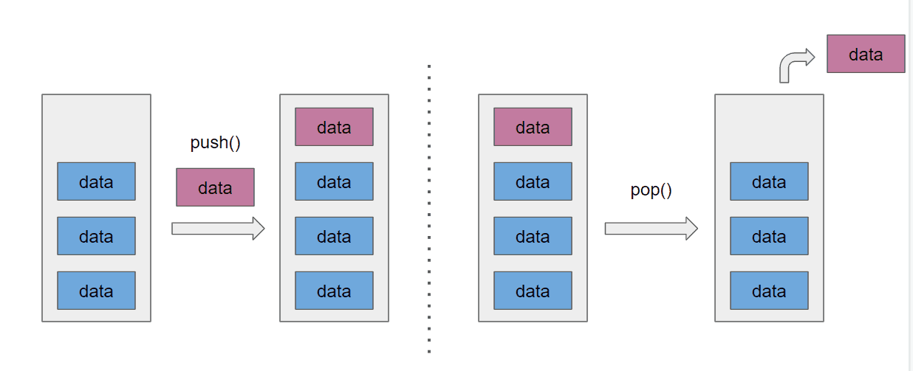
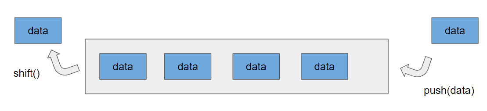

# 자료구조

자료구조(Data structure)는 데이터들의 모임, 관계, 함수, 명령 등의 집합을 의미한다. 즉, 처리하고자 하는 데이터들이 모여 있는 형태, 혹은, 처리하고자 하는 데이터들 사이의 관계 (수직, 상하, 일방적, 상호 등)를 정의한 것, 혹은, 데이터들을 사용하기 용이하게 저장해 놓은 형태라고 볼 수 있다.

[큐와 스택의 실제 사용 예](https://hashcode.co.kr/questions/1830/%EC%9E%90%EB%A3%8C%EA%B5%AC%EC%A1%B0%ED%81%90-%EC%99%80-%EC%8A%A4%ED%83%9D%EC%9D%98-%EC%8B%A4%EC%A0%9C-%EC%82%AC%EC%9A%A9%EC%98%88%EB%A5%BC-%EC%95%8C%EA%B3%A0%EC%8B%B6%EC%8A%B5%EB%8B%88%EB%8B%A4)

<br>

### Stack



### Queue

스택은 데이터를 순서대로 쌓는 자료구조의 형태로, 마지막에 삽입된 항목만을 제거하고 접근할 수 있다. 예를들어 탁자 위에 그릇을 쌓는 과정을 상상해보자. 가장 아래에 있는 그릇을 꺼내기 위해서는 위에 쌓인 다른 모든 그릇들을 제거해야 한다. 이러한 원리를 후입선출(LIFO, last in first out)이라고 부른다. 자바스크립트에서 배열에는 스택클래스를 정의한 pop과 push라는 메소드가 있다. 


 **스택의 활용 예시**

- 웹 브라우저 방문기록 (뒤로 가기) : 가장 나중에 열린 페이지부터 다시 보여준다.
- 역순 문자열 만들기 : 가장 나중에 입력된 문자부터 출력한다.
- 실행 취소 (undo) : 가장 나중에 실행된 것부터 실행을 취소한다.
- 후위 표기법 계산
- 수식의 괄호 검사 (연산자 우선순위 표현을 위한 괄호 검사)

<br>

**Stack 구현**

```js
class Stack {
  constructor() {
    this.storage = {};
    this.top = 0; // 스택의 가장 상단을 가리키는 포인터 변수를 초기화 합니다.
  }

  size() {
    return Object.keys(this.storage).length;
  }

	// 스택에 데이터를 추가 할 수 있어야 합니다.
  push(element) {
    this.storage[Object.keys(this.storage).length] = element;
    this.top += 1;
  }
	
	// 가장 나중에 추가된 데이터가 가장 먼저 추출되어야 합니다.
  pop() {
    // 빈 스택에 pop 연산을 적용해도 에러가 발생하지 않아야 합니다
    if (this.top === 0) {
      return;
    }

    const result = this.storage[this.top - 1];
    delete this.storage[this.top - 1];
    this.top -= 1;
    
    return result;
  }
}

const stack = new Stack();

stack.size(); // 0
for(let i = 1; i < 10; i++) {
  	stack.push(i);
}
stack.pop(); // 9
stack.pop(); // 8
stack.size(); // 7
stack.push(8);
stack.size(); // 8
...
```


### Queue



큐는 스택과 달리 첫 번째로 추가된 항목만을 제거할 수 있는 자료구조다. 이러한 원리를 선입선출(FLFO, first in, first out)이라고 한다. 연산이 상수시간이라는 점이 큐의 장점이다. 큐는 스택과 비슷하게 한 번에 한 개의 항목만 접근할 수 있기 때문에 한계를 갖는다. 자바스크립트에서 배열에는 큐 클래스를 정의한 shift()와 push()라는 메소드가 있다.

Shift()는 배열의 0번째 요소를 제거해 반환한다. 큐에 항목을 추가하는 것은 인큐(enqueue)라 하고, 큐에서 항목을 제거하는 것을 디큐(dequeue)라고 한다. Shift()는 디큐에, push()는 인큐에 대해 사용할 수 있다.

<br>

 **큐의 활용 예시** 

큐는 주로 데이터가 입력된 시간 순서대로 처리해야 할 필요가 있는 상황에 이용한다.

- 우선순위가 같은 작업 예약 (프린터의 인쇄 대기열)
- 은행 업무
- 콜센터 고객 대기시간
- 프로세스 관리
- 너비 우선 탐색(BFS, Breadth-First Search) 구현
- 캐시(Cache) 구현

<br>

**Queue 구현**

```js
class Queue {
  constructor() {
    this.storage = {};
    this.front = 0;
    this.rear = 0;
  }

  size() {
    return Object.keys(this.storage).length
  }
	
	// 큐에 데이터를 추가 할 수 있어야 합니다.
  enqueue(element) {
    this.storage[this.rear] = element;
    this.rear += 1;
  }
	
	// 가장 먼저 추가된 데이터가 가장 먼저 추출되어야 합니다.
  dequeue() {
    // 빈 큐에 dequeue 연산을 적용해도 에러가 발생하지 않아야 합니다
    if (this.size() <= 0) {
      return;
    }

    const result = this.storage[this.front];
    delete this.storage[this.front];
    this.front += 1;

    return result;
  }
}

const queue = new Queue();

queue.size(); // 0
for(let i = 1; i < 10; i++) {
  	queue.enqueue(i);
}
queue.dequeue(); // 1
queue.dequeue(); // 2
queue.size(); // 7
queue.enqueue(10);
queue.size(); // 8
queue.dequeue(); // 3
queue.dequeue(); // 4
queue.size(); // 6
...
```
<br>

### 참고자료
[자바스크립트로 하는 자료 구조와 알고리즘](https://www.aladin.co.kr/shop/wproduct.aspx?ItemId=204103185)